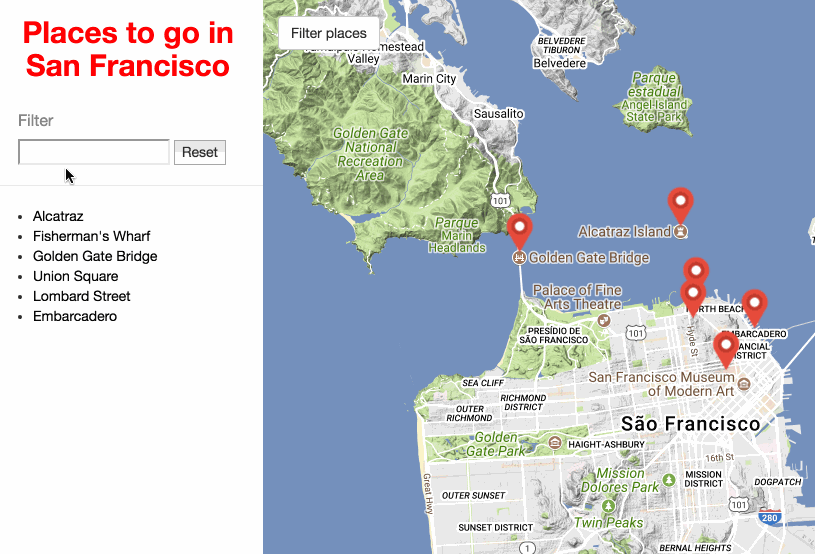

# Neighborhood Map Project

## Project Overview

Made a project of a single-page web application, built using the Knockout framework, that displays a Google map of an area and various points of interest. Users can search all included landmarks and, when selected, additional information about a landmark is presented from the FourSquare and Wikipedia APIs.

## Running the Project

* Download or clone the repository into your local computer.
* Open index.html with your favorite browser.
* On the left, you will find some places to go in San Francisco. Just click to see the location on the map.
* You have option to see all markers or hide Them.
* If you prefer, you can hide the side menu.

The app uses a map API provided by Google.